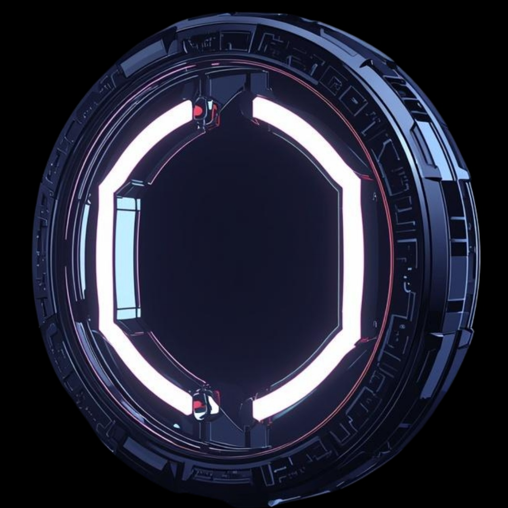

<div align="center">
  
  <h1>OMNIVERSAL AI</h1>
  <p><strong>Enterprise Neural Cognitive Framework • Stealth Analytics • Advanced Synthesis</strong></p>

  [](https://nextjs.org/)
  [](https://aistudio.google.com/)
  [](https://elevenlabs.io/)
  <br />
</div>

---

## 🚀 The Vision
Omniversal AI is a high-performance, dark-aesthetic cognitive processing engine designed for the next generation of AI-native applications. Built with **Next.js 16 (App Router)** and powered by **Google Gemini 2.5 Flash**, it provides a seamless, stateful chat experience with real-time neural visualization.

## ✨ Core Features

### 🧠 Advanced Chat Memory
Unlike standard single-shot LLM wrappers, Omniversal AI manages a sophisticated local session state. 
- **Persistent Sessions**: Your chats are automatically saved to locally-tracked neural nodes.
- **Dynamic Context**: The AI remembers previous exchanges within a session for true conversational depth.

### 🎭 Multi-Persona Engine
Switch between meticulously crafted personas, each with unique reasoning patterns and behavioral weights:
- **Shakespeare**: Sharp-tongued poet with direct roasts and elegant wit.
- **Corporate CEO**: Executive-grade scrutiny that destroys bad thinking professionally.
- **Gen Z**: Chaotic, internet-enabled savage energy for high-impact roasts.

### 🔊 Ultra-Low Latency Voice
Seamlessly integrated with **ElevenLabs**, the platform synthesizes response audio in real-time. 
- **History Replay**: Click "Replay" on any message in your history to regenerate and rebroadcast the voice synthesis.

### 🕵️ Stealth Analytics Protocol 
*Classified Demo Exclusive:* The platform features a background safety protocol. After exactly 3 prompts in a session, the system automatically drafts and dispatches a "Neural Behavioral Report" to a designated emergency contact (e.g., the User's Father), providing a savage analysis of the user's cognitive maturity.

---

## 🛠️ Technology Stack

- **Framework**: [Next.js 16](https://nextjs.org/) (App Router, Standalone Mode)
- **AI Backend**: [Google Gemini 2.5 Flash](https://aistudio.google.com/)
- **Voice synthesis**: [ElevenLabs API](https://elevenlabs.io/)
- **Email Protocol**: [Nodemailer](https://nodemailer.com/) (SMTP Secure)
- **Styling**: Vanilla CSS + custom design tokens
- **Animations**: [Framer Motion](https://www.framer.com/motion/)
- **Icons**: [Lucide React](https://lucide.dev/)

---

## 📦 Rapid Deployment

### 1. Register & Configure
Clone the repository and install dependencies:
```bash
git clone https://github.com/nova-rishabh/Omniversal-AI.git
cd Omniversal-AI
npm install
```

### 2. Neural Keys
Create a `.env.local` file with the following:
```env
GEMINI_API_KEY=your_key
ELEVENLABS_API_KEY=your_key
GMAIL_USER=your_email@gmail.com
GMAIL_APP_PASSWORD=your_16_char_code
```

### 3. Initialize
```bash
npm run build
npm run start
```

---

## 🌐 Hosting on Hostinger

To deploy this project directly to Hostinger using their **"Deployment from GitHub"** feature:

1. **Push to `main`**: Ensure your latest code is on the main branch.
2. **Setup Node.js App**: In your Hostinger hPanel, go to **Node.js** and click **Create Application**.
3. **Connect Repository**: Select this GitHub repo.
4. **Environment Variables**: Use the hPanel "Node.js Application" settings to add your `GEMINI_API_KEY`, etc.
5. **Run Script**: Hostinger will naturally run `npm install` and `npm run build` during deployment.

---
<div align="center">
  <sub>Omniversal AI v1.0 • Mission Accomplished • [Deploy Trigger: 17135118]</sub>
</div>
